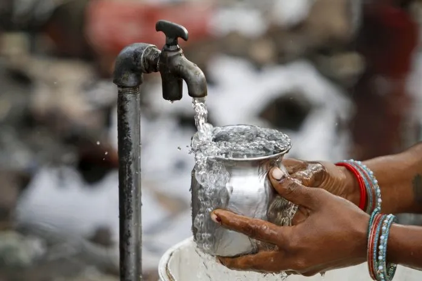
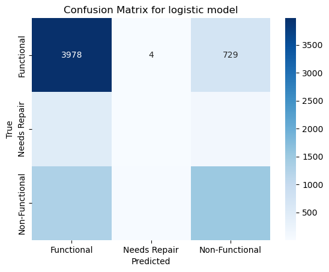
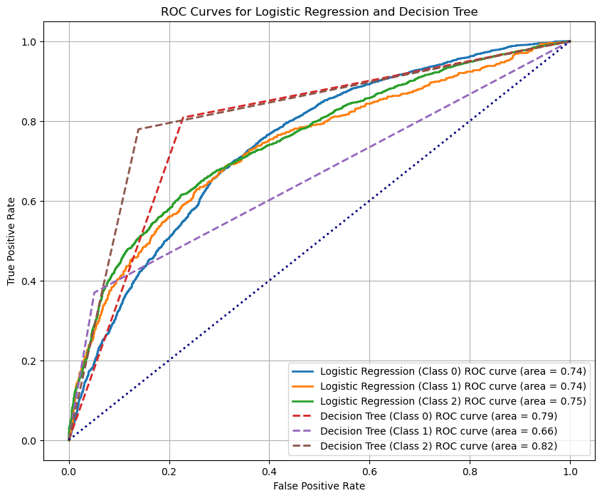

### Overview

Tanzania, as a developing country, struggles with providing clean water to its population of over 57,000,000. There are many water points already established in the country, but some are in need of repair while others have failed altogether.

We are going to build a classifier to predict the condition of a water well, using
historical data about well features, such as location, pump type, and installation year, we aim to classify wells into one of three categories: functional, functional but in need of repair, or non-functional.This classification can aid NGOs and the Tanzanian government in identifying wells that require maintenance or replacement, improving water accessibility.

To achieve this, we will build a machine learning model that leverages the available features to predict the condition of the wells. By following the full data science process, from data preprocessing to model evaluation, we will iteratively refine the model to improve its accuracy. Ultimately, this project will provide actionable insights for resource allocation, ensuring that the wells in most critical need are prioritized for maintenance or replacement.

## Data Understanding

#### Data Source

The data for this project comes from the Taarifa waterpoints dashboard, which aggregates data from the Tanzania Ministry of Water. The Ministry of Water describes Taarifa as such "Taarifa is an open source platform for the crowd sourced reporting and triaging of infrastructure related issues. Think of it as a bug tracker for the real world which helps to engage citizens with their local government. We are currently working on an Innovation Project in Tanzania, with various partners."

The Taarifa homepage can be found by following this link: https://taarifa.org/

To solve  classification problem with the Tanzanian Water Wells dataset, we'll primarily work with both Training set values and Training set labels to build and train your model.
1.	Training Set Values:
- This dataset contains the independent variables (features) that describe each water well. These features will be used to predict the well's condition.

2.	Training Set Labels:

-	This dataset contains the dependent variable (target), which is the condition of each well. The column you will focus on is typically labeled as status_group, with categories such as "functional," "functional but needs repair," and "non-functional." This is our target for classification.

#### Common Columns in the Tanzania Water Wells Dataset:

id: A unique identifier for each well.

amount_tsh: The total static head (amount of water) in the well in liters.

date_recorded: The date the information was recorded.

funder: Who funded the well.

gps_height: Altitude of the well.

installer: Who installed the well.

longitude: Longitude of the well's location.

latitude: Latitude of the well's location.

wpt_name: The name of the waterpoint.

basin: The basin where the well is located.

subvillage: The sub-village where the well is located.

region: The region where the well is located.

district_code: The district code for the well's location.

lga: The local government area for the well.

ward: The ward where the well is located.

population: The population around the well.

public_meeting: Boolean indicating if there was a public meeting.

recorded_by: Who recorded the data (almost always 'Government').

scheme_management: Who operates the waterpoint.

scheme_name: The name of the water scheme.

permit: Boolean indicating whether the well has a permit.

construction_year: The year the well was constructed.

extraction_type: The type of extraction method used.

extraction_type_group: Grouped type of extraction method.

extraction_type_class: Class of extraction method.

management: Who manages the well.

management_group: Group of management.

payment: The type of payment system used.

payment_type: Type of payment.

water_quality: The quality of water at the well.

quality_group: Grouped quality of water.

quantity: The quantity of water.

quantity_group: Grouped quantity of water.

source: The source of water.

source_type: The type of water source.

source_class: The class of water source.

waterpoint_type: The type of waterpoint.

waterpoint_type_group: Grouped type of waterpoint.

#### Modelling

#### Logistic regression 

The logistic regression model performance shows moderate success with an accuracy of 67.43%, which means that the model correctly predicted the well status about 67% of the time. Below are the interpretations of the findings in more detail:

Key Metrics

Accuracy (0.6743): This indicates that the model correctly predicted the class of the wells 67.43% of the time. 

Precision (0.6413): Precision tells us how many of the wells predicted as a certain class (e.g., functional, non-functional) were actually correct. A precision of 64.13% means that when the model predicts a certain class, it is correct about 64% of the time.

Recall (0.6743): Recall indicates how well the model captures all the relevant cases. A recall of 67.43% shows that the model correctly identifies 67% of the actual positive cases.

F1-score (0.6435): The F1-score is the harmonic mean of precision and recall, balancing the two. A score of 64.35% reflects a reasonable trade-off between precision and recall.

#### Confusion Matrix

The confusion matrix breaks down the performance by individual class predictions:

Class 0 (Functional Wells): The model predicted 3,978 wells correctly, but misclassified 729 wells as non-functional and 4 wells as "functional needs repair." The model performs best for this class with a high recall (84%).

Class 1 (Functional Needs Repair Wells): The model struggles with this class, predicting only 9 wells correctly out of 603. This is reflected in the low precision (26%) and recall (1%).

Class 2 (Non-Functional Wells): The model correctly predicts 1,510 wells as non-functional but misclassifies 1,306 wells as functional. The recall for this class is relatively low at 53%.

#### Confusion Matrix

The confusion matrix breaks down the performance by individual class predictions:

Class 0 (Functional Wells): The model predicted 3,978 wells correctly, but misclassified 729 wells as non-functional and 4 wells as "functional needs repair." The model performs best for this class with a high recall (84%).

Class 1 (Functional Needs Repair Wells): The model struggles with this class, predicting only 9 wells correctly out of 603. This is reflected in the low precision (26%) and recall (1%).

Class 2 (Non-Functional Wells): The model correctly predicts 1,510 wells as non-functional but misclassifies 1,306 wells as functional. The recall for this class is relatively low at 53%.

#### Classification Report

Class 0 (Functional Wells): This class has the highest precision and recall. The model performs well in detecting functional wells but struggles with classifying the other two categories.

Class 1 (Functional Needs Repair Wells): This class has poor performance, with very low precision (26%) and recall (1%). The model is failing to identify this class effectively.

Class 2 (Non-Functional Wells): The model has a moderate performance on this class, with decent precision (64%) but lower recall (53%).

#### Summary

The logistic regression model does a good job of identifying functional wells but struggles significantly with detecting wells that need repair or are non-functional. The poor performance for "functional needs repair" wells indicates that the model needs improvement, possibly by exploring more complex models or better feature engineering. 

#### Decision tree Model
The Decision Tree model performs notably better than the logistic regression model, with an overall accuracy of 76.58%, indicating that it predicts the well status correctly about 77% of the time. Below are interpretations of the key metrics and insights:

Key Metrics

Accuracy (0.7658): The model has a higher accuracy compared to logistic regression, correctly predicting the class of the wells about 77% of the time.

Precision (0.7672): Precision is fairly high, especially for the functional and non-functional wells. It means that, when the model predicts a certain class, it's correct about 77% of the time overall.

Recall (0.7658): This indicates the model correctly identifies 77% of the actual cases across all classes, showing a good ability to detect true positives.

F1-score (0.7663): The F1-score, which balances precision and recall, is consistent with the other metrics, reflecting a strong performance across the board.

#### Confusion Matrix
The confusion matrix breaks down the predictions for each class:

Class 0 (Functional Wells): The model correctly predicts 3,809 functional wells but misclassifies 267 wells as "functional needs repair" and 635 wells as non-functional. This class has strong performance with both high precision and recall.

Class 1 (Functional Needs Repair Wells): The model correctly predicts 223 of the wells needing repair, but 276 wells are wrongly classified as functional, and 104 are misclassified as non-functional. The performance for this class is moderate, but better than logistic regression.

Class 2 (Non-Functional Wells): The model predicts 2,211 non-functional wells correctly, but misclassifies 509 as functional and 118 as needing repair. The model is doing well at identifying non-functional wells, with a high recall of 78%.

#### Classification Report

Class 0 (Functional Wells): The precision (83%) and recall (81%) for functional wells are strong, suggesting the model performs well at identifying wells that are in working condition. The F1-score of 82% reflects a balanced performance for this class.

Class 1 (Functional Needs Repair Wells): Precision (37%) and recall (37%) are much lower for this class. While the performance is still limited, it is better than what we saw in logistic regression. There’s still considerable room for improvement, particularly for identifying wells needing repair.

Class 2 (Non-Functional Wells): The model performs well in this class, with precision (75%) and recall (78%) reflecting its good ability to detect non-functional wells. The F1-score of 76% shows a good balance between precision and recall.

#### ROC Curves for Logistic Regression and Decision Tree

The ROC (Receiver Operating Characteristic) curve is a graphical tool used to evaluate the performance of our models, specifically how well they distinguish between different conditions of water wells. Each curve represents the trade-off between the true positive rate (sensitivity) and the false positive rate (fallout) for each class.

In the graph, we have two sets of ROC curves:

Solid lines represent the performance of our Logistic Regression model.

Dashed lines represent the performance of our Decision Tree model.

The closer a curve is to the top-left corner, the better the model's ability to distinguish between functional, non-functional, and wells requiring repair. The area under each curve (AUC score) indicates the overall performance. A higher AUC suggests that the model has better predictive accuracy.

These curves help us visually compare which model is better at predicting the well conditions. In this case, you can see that both models perform reasonably well, with the Decision Tree showing slightly better performance across some classes.

#### Limitations:
- The data might be imbalanced, which could affect the performance of the classifier.
- Missing values were imputed, which might have introduced bias into the model.
- Some important features could be missing, such as real-time sensor data or seasonal information.

#### Future Work:
- Collect more data over a longer time period to improve model performance.
- Incorporate real-time monitoring for water wells, which could enable more accurate predictions.
- Experiment with more advanced machine learning algorithms, such as XGBoost or neural networks.

#### Recommendation

Based on the findings and model evaluations from the Tanzania Water Wells project, the following recommendations can be made:

1. Prioritize Non-Functional Wells for Maintenance and Repair

The Decision Tree model accurately classifies non-functional wells with a recall of 78%, making it a reliable tool for identifying wells that require immediate attention. NGOs or government agencies can use this model to prioritize their resources and allocate them to the areas most in need of intervention. This will enhance efforts in providing sustainable access to clean water by ensuring non-functional wells are promptly repaired.

2. Further Investigate Wells Needing Repair

The model struggles with identifying wells that are functional but need repairs, with a precision and recall around 37%. This lower performance suggests that additional data collection or feature engineering might be needed to better understand this class. It is recommended that stakeholders investigate what additional factors might be contributing to the need for repair, such as environmental conditions, maintenance history, or usage patterns. This data could then be incorporated into future models for improved predictions.

3. Implement Predictive Maintenance Programs

Based on the models’ ability to predict well functionality, stakeholders can develop predictive maintenance programs. By monitoring wells predicted to be at risk of failure or needing repair, proactive measures can be taken to avoid costly breakdowns. This approach could minimize downtime for communities dependent on these water sources and lead to more efficient management of water resources.

4. Long-Term Policy Planning

Insights from the model can inform policy decisions, particularly regarding where to invest in new well construction or repair efforts. By analyzing which features are most influential in predicting well failures (such as pump type, installation year, and geographical location), policy makers can make data-driven decisions about future well installations and maintenance schedules.